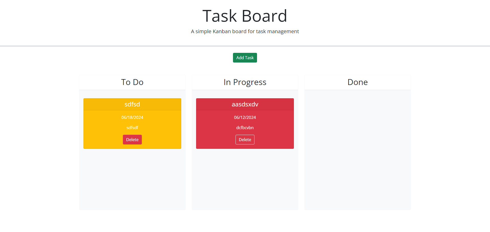

# Task-Board

## Description

Updated code to a task board that enables a user to create a task, drag and drop into different columns, changes colors dependent on due date, and delete cards.

https://github.com/ronhoover97/Task-Board

https://ronhoover97.github.io/Task-Board/
